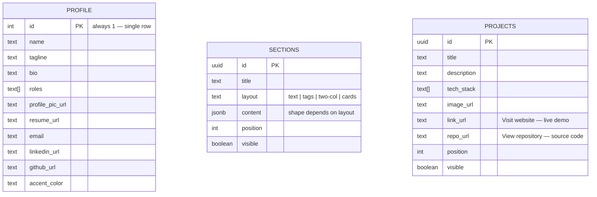

# Architecture

## System overview

```mermaid
flowchart LR
    Visitor((Visitor)) -->|GET /| Next[Next.js Server Component]
    Owner((You)) -->|sign in| Login[/admin/login/]
    Owner -->|edit content| Admin[/admin/*]

    Next -->|select, RLS: public read| DB[(Supabase Postgres)]
    Admin -->|server actions: insert/update/delete| DB
    Admin -->|upload| Storage[(Supabase Storage: media bucket)]
    Login -->|signInWithPassword| Auth[Supabase Auth]

    Storage -->|public URL| Next
```

There is no separate backend API — Next.js Server Components query Supabase
directly at request time, and the admin pages call **Server Actions** (functions
that run on the server, invoked directly from a `<form action={...}>`) to write
back to the same database. This keeps the whole app in one Next.js project with
no API routes to maintain.

## Data model



- **`profile`** is intentionally a single row (`id` is constrained to `1`). It backs
  the hero section and footer — there's only ever one identity to show.
- **`sections`** is the flexible part of the content model. `layout` decides how
  `content` is interpreted:
  - `"text"` → `{ "body": "..." }`, rendered as a single paragraph
  - `"tags"` → `{ "tags": ["Python", "React", ...] }`, rendered as a chip grid
    (used for Skills) — each chip optionally gets an icon if the name matches
    `src/lib/skillIcons.ts`'s lookup table, otherwise it's just a text chip
  - `"two-col"` / `"cards"` → `{ "items": [{ "title", "body", "tag"? }] }`, rendered
    as a responsive grid of boxes. This is what lets you add a brand-new section
    (e.g. "Experience") without any code change — the renderer in `page.tsx` just
    switches on `layout`.
- **`projects`** is a dedicated table rather than another `sections` row because it
  has its own shape (image, tech stack, two distinct external links) and its own
  ordering. `link_url` and `repo_url` render as two separate buttons ("Visit
  website" / "View repository") so each opens the right destination directly —
  a project with only one of the two just shows that one button.

## Request flow (public site)

`src/app/page.tsx` is an `async` Server Component. On every request it:
1. Opens a Supabase client scoped to the incoming request's cookies (`lib/supabase/server.ts`)
2. Runs three queries in parallel: `profile` (single row), `sections` (where `visible = true`, ordered), `projects` (same)
3. Renders directly from that data — no client-side fetching, no loading spinners

`export const dynamic = "force-dynamic"` on that page disables Next.js's default
static caching for it, which is what makes admin edits appear immediately instead
of waiting for a rebuild.

## Auth & security model

- **Supabase Auth** holds exactly one user: you. There is no public sign-up route
  anywhere in this app — the only way to create an account is through the Supabase
  dashboard (see `docs/DEPLOYMENT.md`).
- **`src/middleware.ts`** (via `lib/supabase/middleware.ts`) runs on every request to
  `/admin/*`. It refreshes the Supabase session cookie and redirects to
  `/admin/login` if there's no logged-in user — so even if someone guesses an admin
  URL, they're bounced before any page code runs.
- **Row Level Security (RLS)**, defined in `supabase/schema.sql`, is the second layer:
  even if someone got a valid request to the database directly, Postgres itself
  only allows:
  - anyone to `select` from `profile`, and from `sections`/`projects` where `visible = true`
  - only an authenticated user (`auth.uid() is not null`) to `insert`/`update`/`delete`
    anywhere, or to write to the `media` storage bucket

  Because only one account exists, "authenticated" and "the owner" are equivalent —
  this is a deliberate simplification for a single-admin site rather than a general
  multi-user permission system.

## Why Server Actions instead of an API layer

Every mutation (`updateProfile`, `addSection`, `uploadProjectImage`, etc., in
`src/app/admin/actions.ts`) is a Server Action: a plain async function marked
`"use server"` that a `<form>` calls directly. Next.js handles the network request,
serialization, and re-running the page's data fetch (`revalidatePath`) under the
hood. This avoids hand-writing `/api/*` routes, request parsing, and client-side
`fetch` calls for what is, structurally, a small set of CRUD operations behind a
single admin.
